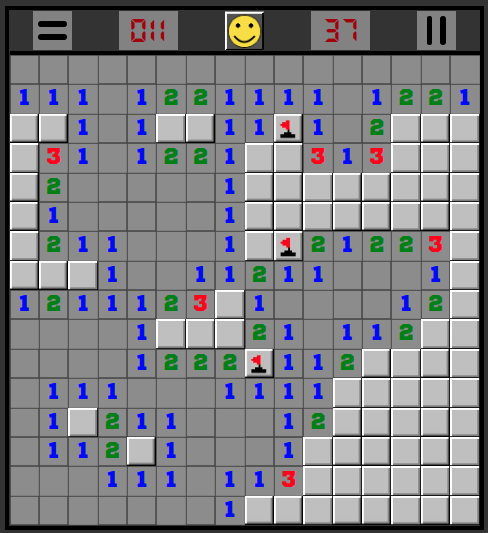

<h1 align="center">The minesweeper</h1>
<p align="center">[The minesweeper](https://vlsrnd.github.io/sapper-game/)</p>
<p align="center">

</p>

### Install
```
npm install
```
### Usage
```
npm run start
```
### Build
```
npm run build
```

What was used:
- Webpack 5;
- JS:
  + object, array, Map, Class;
  + destructuring assignment;
  + JSON;
  + scheduling: setTimeout;
  + closure;
  + spread;
  + async/await;
  + work with DOM;
  + matchMedia (media queries from JS);
  + browser event, event delegation;
  + mouse event;
  + forms;
  + localStorage;
  + canvas (2d);
  + requestAnimationFrame;
____
:negative_squared_cross_mark: Mobile is not support. :negative_squared_cross_mark:
Well, really, this game is inconvenient for touch screens.
